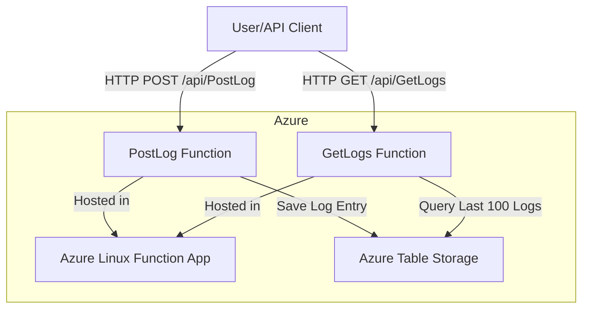

# Log Service - Azure Functions (PowerShell)

## Overview
This project implements a simple log service using Azure Functions (PowerShell) and Azure Table Storage, fully provisioned via **Terraform**.

### Functions
- **PostLog**: Receives a log entry via HTTP POST and stores it securely.
- **GetLogs**: Returns the 100 most recent log entries via HTTP GET.

### Log Entry Format
- `ID`: Unique identifier (RowKey)
- `DateTime`: Timestamp (ISO 8601)
- `Severity`: info, warning, or error
- `Message`: Log message

## Deployment Instructions

### Prerequisites
- Azure CLI
- Terraform
- PowerShell 7+
- Azure Functions Core Tools
- Sufficient Azure permissions

### 1. Provision Infrastructure
```powershell
cd terraform
terraform init
terraform validate
terraform apply -auto-approve
```

### 2. Deploy Functions
```powershell
cd ../src
func azure functionapp publish <function_app_name>
```
- Get `<function_app_name>` from Terraform output or Azure Portal.

### 3. Secure Credentials
- Uses managed identity and function-level auth.
- Storage is encrypted at rest.
- No secrets are hardcoded.

### 4. API Usage
- **POST /api/PostLog**
  - Body: `{ "Severity": "info", "Message": "Test log" }`
- **GET /api/GetLogs**
  - Returns: Array of last 100 log entries

## Local Testing
1. Install [Azure Functions Core Tools](https://learn.microsoft.com/azure/azure-functions/functions-run-local).
2. Install required PowerShell modules:
   ```powershell
   Install-Module AzTable -Scope CurrentUser
   Install-Module Az.Accounts -Scope CurrentUser
   ```
3. Start the function app locally:
   ```powershell
   func start
   ```
4. Use tools like curl or Postman to test the endpoints.

## Security
- Function-level authentication
- HTTPS enforced
- Storage encryption
- Least privilege via managed identity
- Security checks in CI/CD pipeline

## Pipeline
- See `.github/workflows/deploy.yml` for CI/CD with security checks, Terraform provisioning, and Azure Function deployment.

## Troubleshooting
- Ensure AzTable and Az.Accounts modules are available in your environment.
- Check Azure portal logs for function errors.
- Use `func azure functionapp logstream <function_app_name>` for live logs.

---

# Azure Log Service (Serverless)

## Architecture



## Deployment & Usage Instructions

### 1. Push Your Code to GitHub

```sh
git init
git remote add origin https://github.com/Veyz26/azure-log-service-serverless.git
git add .
git commit -m "Initial commit"
git push -u origin main
```

### 2. Add GitHub Secrets
- Go to **Settings > Secrets and variables > Actions > New repository secret** in your GitHub repo.
- Add:
  - `AZURE_CLIENT_ID`
  - `AZURE_TENANT_ID`
  - `AZURE_SUBSCRIPTION_ID`

### 3. Pipeline
- On every push to `main`, the pipeline will:
  - Run security checks (CodeQL, tfsec)
  - Apply Terraform (provision/update Azure resources)
  - Deploy your Azure Functions

### 4. Test the Endpoints
- After deployment, get your function app URL from the Azure Portal or Terraform output.

#### a. PostLog (POST)
- URL: `https://<your-function-app-name>.azurewebsites.net/api/PostLog?code=<function-key>`
- Body (JSON):
  ```json
  {
    "Severity": "info",
    "Message": "Test log message"
  }
  ```
- Example with curl:
  ```sh
  curl -X POST "https://<your-function-app-name>.azurewebsites.net/api/PostLog?code=<function-key>" \
    -H "Content-Type: application/json" \
    -d '{"Severity":"info","Message":"Test log message"}'
  ```

#### b. GetLogs (GET)
- URL: `https://<your-function-app-name>.azurewebsites.net/api/GetLogs?code=<function-key>`
- Example with curl:
  ```sh
  curl "https://<your-function-app-name>.azurewebsites.net/api/GetLogs?code=<function-key>"
  ```

- The response will be a JSON array of the 100 most recent log entries.

---

For any issues, check your GitHub Actions runs and Azure Portal for logs and troubleshooting.
